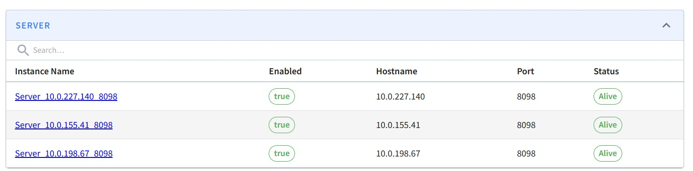
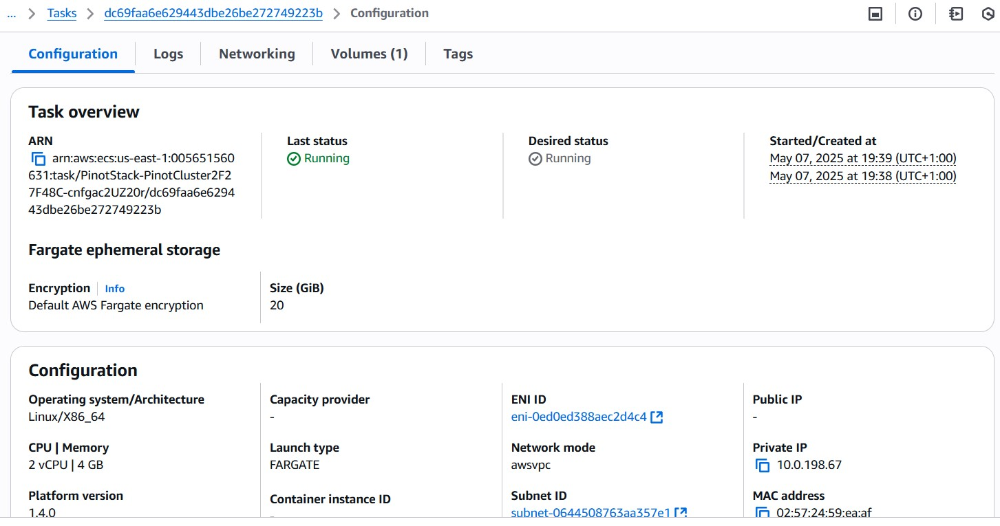

# StatefulSet CDK Construct

A reusable AWS CDK construct for deploying **stateful services** (like Zookeeper, Apache Pinot, etc.)
on **ECS Fargate** with persistent storage using EBS Volume/Snapshots and service discovery.

Key Features:
- Stable DNS names for replicas
- Ordered scale up and down
- One EBS volume per replica that is snapshoted and recreated on scale down or task failure (Fargate doesn't support attaching existing volumes)
- Optional environment variable injection per task (e.g. MY_ID: $index)
- A managed **Target Group** accessible via the `targetGroup` property
- Works using a simple Lambda control loop executed by an Event Bridge Rule

---

## Installation

Add this construct to your CDK project:

```ts
import { StatefulSet } from './stateful-set';
```

---

## Usage Example: Zookeeper Cluster

```ts
new StatefulSet(this, 'ZookeeperStatefulSet', {
  vpc: vpc,
  name: 'zk',
  cluster: zookeeperCluster,
  taskDefinition: zookeeperTaskDefinition,
  hostedZone: hostedZone,
  securityGroup: zookeeperSecurityGroup,
  replicas: 3,
  environment: {
    ZOO_SERVERS: "server.0=zk-0.svc.internal:2888:3888;2181 server.1=zk-1.svc.internal:2888:3888;2181 server.2=zk-2.svc.internal:2888:3888;2181",
    ZOO_MY_ID: '$index'
  }
});
```

- Each task will be reachable at `zk-0.svc.internal`, `zk-1.svc.internal`, etc.
- The `$index` placeholder is automatically replaced with the task's index (0, 1, 2, ...)

---

## Full Example with Apache Pinot

A full example demonstrating how to deploy a stateful Apache Pinot cluster using this construct is provided in:

[`src/demo/apachepinot.ts`](/demo/apachepinot.ts)

### To run the example:

```bash
npx tsc
cdk --app "npx ts-node src/demo/apachepinot.ts" deploy
```

This will compile the project and deploy the stack defined in `apachepinot.ts` using the AWS CDK.

Each Pinot component corresponds to a Fargate task

### Pinot Dashboard Showing Servers



### Pinot Server Tasks in Fargate




The controller UI will be available at http://controller.svc.internal:9000

## Accessing Services Locally

You can access internal services (like the Pinot Controller UI) on your local machine by port forwarding.

- **AWS SSM (with SSO)**:
  ```bash
  aws ssm start-session \
    --target i-xxxxxxxxxxxxxxxxx \
    --document-name AWS-StartPortForwardingSession \
    --parameters '{"portNumber":["9000"],"localPortNumber":["9000"]}'
  ```

- **SSH (with key pair)**:
  ```bash
  ssh -i mypem.pem -L 9000:controller.svc.internal:9000 ec2-user@<bastion-ip>
  ```

Once forwarded, open [http://localhost:9000](http://localhost:9000) in your browser.

## Props

```ts
export interface StatefulSetProps {
  name: string; // Base name for the services and DNS records
  taskDefinition: ecs.FargateTaskDefinition;
  cluster: ecs.ICluster;
  hostedZone: route53.IHostedZone; // Used for DNS registration (e.g. zk-0.svc.internal)
  replicas: number; // Number of service instances to run
  subnets?: ec2.ISubnet[]; // Optional subnets to place the tasks in
  securityGroup: ec2.ISecurityGroup;
  environment?: Record<string, string>; // Optional environment variables
  vpc: ec2.IVpc;
  volumeSize?: number; // Optional volume size per task (in GiB)
  enableExecuteCommand?: boolean; // Enable ECS Exec for debugging
}
```

---

## Service Discovery

The construct uses a Route 53 hosted zones to register each replica under a predictable DNS name:

```
<name>-<index>.<hostedZone>
e.g., zk-0.svc.internal
```

---

## Target Group and Load Balancing

The construct exposes a `targetGroup` property which can be used to route traffic to all replicas.

Example:

```ts
loadBalancer.addListener('Listener', {
  port: 2181,
  defaultTargetGroups: [statefulSet.targetGroup],
});
```

---


## Cleanup

All volumes and services are tagged with the name of the StatefulSet and can be managed via `ess:<name>:managed`, `ess:<name>:index` tags for cleanup or lifecycle automation.

---